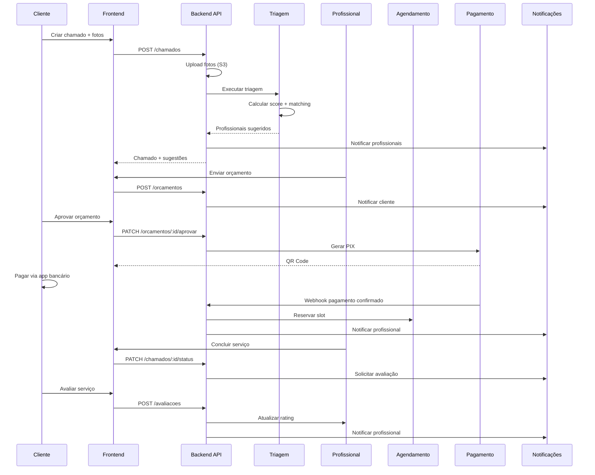

# Arquitetura VITAS - Documentação C4

Esta documentação descreve a arquitetura do sistema VITAS usando o modelo C4 (Context, Containers, Components, Code).

## 📚 Índice

1. [**Context Diagram**](c4-context.md) - Visão geral do sistema e usuários
2. [**Container Diagram**](c4-container.md) - Aplicações e armazenamentos de dados
3. [**Component Diagram**](c4-component.md) - Módulos internos do backend

## 🎯 O que é o Modelo C4?

O modelo C4 é uma forma de documentar arquitetura de software em 4 níveis de abstração:

- **Level 1 - Context**: Mostra o sistema no contexto do mundo real (usuários e sistemas externos)
- **Level 2 - Containers**: Mostra as aplicações e armazenamentos que compõem o sistema
- **Level 3 - Components**: Mostra os componentes internos de cada container
- **Level 4 - Code**: Diagramas UML de classes (não incluído - ver código-fonte)

## 📊 Diagramas Rápidos

### Context (Nível 1)
```
Cliente/Profissional/Admin
        ↓
  Sistema VITAS
        ↓
Firebase/S3/Payment/Maps
```

### Containers (Nível 2)
```
Frontend (React + Capacitor)
        ↓
  Backend API (NestJS)
        ↓
Database (PostgreSQL) + S3 + Firebase
```

### Components (Nível 3)
```
Core: Auth, Storage, Notification
Business: Chamado, Triagem, Agendamento, Pagamento, etc.
Support: Config, Database, Logger
```

## 🏗️ Decisões de Arquitetura (ADRs)

### 1. Frontend: React + Capacitor
**Decisão**: Usar React com Capacitor para web e mobile

**Razão**:
- ✅ 90%+ code sharing entre plataformas
- ✅ Acesso a APIs nativas (câmera, GPS, push)
- ✅ PWA para web, APK/AAB para mobile
- ✅ Ecossistema maduro

**Alternativas consideradas**:
- ❌ React Native: Menos suporte web
- ❌ Flutter: Time não familiar com Dart
- ❌ Native apps: Desenvolvimento duplicado

### 2. Backend: NestJS + TypeORM
**Decisão**: Usar NestJS com TypeORM

**Razão**:
- ✅ Estrutura modular escalável
- ✅ TypeScript nativo (type safety)
- ✅ Decorators para validação
- ✅ Suporte a microservices (futuro)

**Alternativas consideradas**:
- ❌ Express: Menos estruturado
- ❌ Fastify: Ecossistema menor
- ❌ Django/Flask: Python (time é JS/TS)

### 3. Database: PostgreSQL
**Decisão**: PostgreSQL para produção, SQLite para dev

**Razão**:
- ✅ ACID compliance
- ✅ JSON fields para flexibilidade
- ✅ Full-text search
- ✅ Managed services (Railway, Supabase)
- ✅ SQLite = zero config em dev

**Alternativas consideradas**:
- ❌ MongoDB: Perda de relações complexas
- ❌ MySQL: Menos features (JSON, full-text)

### 4. Storage: AWS S3
**Decisão**: S3 para produção, filesystem para dev

**Razão**:
- ✅ Escalabilidade ilimitada
- ✅ CDN integrado (CloudFront)
- ✅ Signed URLs para segurança
- ✅ Pay-as-you-go

**Alternativas consideradas**:
- ❌ Cloudinary: Mais caro
- ❌ Database BLOB: Não escala

### 5. Notifications: Firebase FCM
**Decisão**: Firebase Cloud Messaging

**Razão**:
- ✅ Suporte Android/iOS/Web
- ✅ Confiável e escalável
- ✅ Gratuito até 10M msgs/dia
- ✅ Integração simples com Capacitor

**Alternativas consideradas**:
- ❌ OneSignal: Vendor lock-in
- ❌ AWS SNS: Mais complexo

### 6. Payment: Gateway TBD
**Decisão**: Integração via gateway (Mercado Pago / PagSeguro)

**Razão**:
- ✅ Compliance PCI-DSS gerenciado
- ✅ PIX nativo
- ✅ Checkout simplificado

**Alternativas consideradas**:
- ❌ Stripe: Sem PIX nativo
- ❌ Implementação própria: Complexidade regulatória

## 🔄 Fluxos Principais

### Fluxo Completo: Criação até Avaliação



## 📈 Evolução da Arquitetura

### Fase 1 - MVP (Atual)
- Monolito modular (NestJS)
- PostgreSQL single instance
- S3 para arquivos
- Firebase FCM para notificações
- **Capacidade**: 100-500 usuários simultâneos

### Fase 2 - Crescimento (3-6 meses)
- Backend: 2-3 instâncias + load balancer
- Database: Read replicas
- Cache: Redis separado
- **Capacidade**: 1.000-5.000 usuários

### Fase 3 - Escala (12 meses)
- Microservices:
  - `chamado-service`
  - `payment-service`
  - `notification-service`
- Database: Sharding por região
- Message Queue: RabbitMQ/SQS
- WebSocket: Servidor separado
- **Capacidade**: 10.000+ usuários

## 🛠️ Ferramentas de Desenvolvimento

### Visualização de Diagramas
- **Mermaid**: Renderizado nativamente no GitHub
- **PlantUML**: Alternativa para diagramas mais complexos
- **Draw.io**: Para diagramas de infraestrutura

### Geração de Código
- **NestJS CLI**: `nest g module|service|controller`
- **TypeORM CLI**: `npm run typeorm migration:generate`

### Monitoramento (Futuro)
- **Sentry**: Error tracking
- **LogRocket**: Session replay
- **DataDog**: APM e logs

## 📝 Convenções

### Nomenclatura de Módulos
```
{feature}.module.ts    # Módulo principal
{feature}.service.ts   # Lógica de negócio
{feature}.controller.ts # Endpoints REST
{feature}.entity.ts    # Modelo de dados (TypeORM)
{feature}.dto.ts       # Data Transfer Objects
{feature}.guard.ts     # Guards de autorização
{feature}.spec.ts      # Testes unitários
```

### Estrutura de Pastas
```
src/
  {feature}/
    dto/
    entities/
    {feature}.module.ts
    {feature}.service.ts
    {feature}.controller.ts
```

## 🔍 Referências

- [C4 Model](https://c4model.com/) - Documentação oficial
- [NestJS Docs](https://docs.nestjs.com/) - Framework backend
- [TypeORM Docs](https://typeorm.io/) - ORM
- [Capacitor Docs](https://capacitorjs.com/) - Mobile framework
- [Firebase FCM](https://firebase.google.com/docs/cloud-messaging) - Push notifications

## 📅 Última Atualização

**Data**: 6 de janeiro de 2026  
**Versão**: 1.0.0  
**Status**: MVP em desenvolvimento (92% completo)

---

**Próximo documento**: [OpenAPI Specification](../api/openapi.json) (Issue #31)
