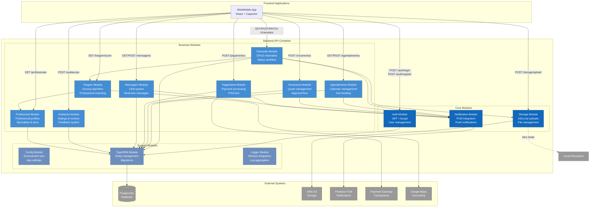

# C4 Model - Component Diagram

## Backend API - Componentes (Módulos NestJS)

Este diagrama mostra os componentes internos do container Backend API.



## Componentes Detalhados

### 🔐 Auth Module (Core)
**Responsabilidade**: Autenticação e autorização

**Entities**:
- `User` - id, email, password (hashed), nome, role, ativo

**Services**:
- `AuthService`:
  - `login(email, password)` → JWT token
  - `register(email, password, nome, role)` → User + token
  - `validateUser(email, password)` → User | null
  - Seed de usuários padrão (cliente, operador, admin)

**Controllers**:
- `POST /auth/register` - Criar conta
- `POST /auth/login` - Autenticar

**Guards**:
- `JwtAuthGuard` - Protege rotas (JWT validation)
- `RolesGuard` - Controle de acesso por role

**Dependencies**:
- `@nestjs/jwt` - Token generation
- `@nestjs/passport` - Strategy pattern
- `bcrypt` - Password hashing (salt rounds: 10)

---

### 📁 Storage Module (Core)
**Responsabilidade**: Upload e gerenciamento de arquivos

**Services**:
- `StorageService`:
  - `uploadFile(file, folder)` → URL
  - `uploadToS3(file, key)` → S3 URL
  - `uploadToLocal(file, path)` → Local path
  - `getSignedUrl(key, expiresIn)` → Signed URL (1h)
  - `deleteFile(key)` → boolean

**Controllers**:
- `POST /storage/upload` - Upload arquivo (multipart/form-data)
  - Max size: 10 MB
  - Allowed: images, videos, PDF

**Validations**:
- File size limit
- MIME type whitelist
- UUID-based naming
- Folder organization

**Configuration**:
- `STORAGE_TYPE`: 's3' | 'local'
- S3 credentials (AWS SDK v3)
- Local path (./uploads)

---

### 🔔 Notification Module (Core)
**Responsabilidade**: Push notifications via Firebase FCM

**Services**:
- `NotificationService`:
  - `sendToDevice(token, payload)` → boolean
  - `sendToMultipleDevices(tokens, payload)` → {success, failure}
  - `sendToTopic(topic, payload)` → boolean
  - `subscribeToTopic(tokens, topic)` → void
  - `unsubscribeFromTopic(tokens, topic)` → void

**Controllers**:
- `POST /notifications/send` - Envio individual
- `POST /notifications/send-multiple` - Envio em lote
- `POST /notifications/send-to-topic` - Broadcast

**Configuration**:
- `FIREBASE_SERVICE_ACCOUNT` - JSON credentials
- Graceful degradation se não configurado

---

### 🛠️ Chamado Module (Business)
**Responsabilidade**: Gestão de chamados de manutenção

**Entities**:
- `Chamado` - id, clienteId, descricao, especialidade, status, fotos[], createdAt

**Services**:
- `ChamadoService`:
  - `create(dto)` → Chamado
  - `findAll(filters)` → Chamado[]
  - `findOne(id)` → Chamado
  - `updateStatus(id, status)` → Chamado
  - `uploadFotos(id, files)` → string[]

**Controllers**:
- `GET /chamados` - Listar (com filtros)
- `GET /chamados/:id` - Detalhes
- `POST /chamados` - Criar
- `PATCH /chamados/:id/status` - Atualizar status
- `POST /chamados/:id/fotos` - Upload fotos

**Status Workflow**:
```
aguardando_triagem → triagem_concluida → aguardando_orcamentos 
→ orcamento_aprovado → agendado → em_andamento 
→ concluido → avaliado
```

---

### 🎯 Triagem Module (Business)
**Responsabilidade**: Algoritmo de triagem e matching

**Services**:
- `TriagemService`:
  - `executarTriagem(chamadoId)` → TriagemResult
  - `calcularScore(chamado)` → number (0-100)
  - `sugerirProfissionais(chamado)` → Profissional[]

**Algoritmo de Scoring**:
```typescript
score = (
  urgencia * 0.3 +        // 30% - Urgência declarada
  complexidade * 0.25 +   // 25% - Análise de descrição/fotos
  historico * 0.20 +      // 20% - Histórico do cliente
  disponibilidade * 0.15 + // 15% - Profissionais disponíveis
  sazonalidade * 0.10     // 10% - Época do ano
)
```

**Matching de Profissionais**:
1. Filtrar por especialidade
2. Calcular distância (Google Maps API)
3. Verificar disponibilidade na agenda
4. Ordenar por rating + proximidade
5. Retornar top 5

---

### 📅 Agendamento Module (Business)
**Responsabilidade**: Gestão de agenda e reservas

**Entities**:
- `Agendamento` - id, chamadoId, profissionalId, dataHora, duracao, status

**Services**:
- `AgendamentoService`:
  - `gerarSlots(profissionalId, data)` → Slot[]
  - `reservarSlot(chamadoId, profissionalId, dataHora)` → Agendamento
  - `cancelar(id)` → void
  - `reagendar(id, novaDataHora)` → Agendamento

**Controllers**:
- `GET /agendamentos/slots` - Slots disponíveis
- `POST /agendamentos` - Reservar
- `PATCH /agendamentos/:id/cancelar` - Cancelar
- `PATCH /agendamentos/:id/reagendar` - Reagendar

**Regras de Negócio**:
- Slots de 1-4 horas (configurável por especialidade)
- Horário comercial: 8h-18h
- Cancelamento até 24h antes
- Reagendamento: máximo 2x

---

### 💰 Pagamento Module (Business)
**Responsabilidade**: Processamento de pagamentos

**Entities**:
- `Pagamento` - id, chamadoId, valor, metodo, status, pixQRCode?, transacaoId

**Services**:
- `PagamentoService`:
  - `gerarPIX(chamadoId, valor)` → QRCode
  - `processarCartao(dados)` → Transacao
  - `verificarStatus(id)` → Status
  - `estornar(id)` → boolean

**Controllers**:
- `POST /pagamentos/pix` - Gerar PIX
- `POST /pagamentos/cartao` - Processar cartão
- `GET /pagamentos/:id/status` - Verificar status
- `POST /pagamentos/:id/estornar` - Estorno

**Integrações**:
- PIX: Mercado Pago / PagSeguro (TBD)
- Cartão: Stripe / PagSeguro (TBD)

---

### 💬 Mensagem Module (Business)
**Responsabilidade**: Chat entre cliente e profissional

**Entities**:
- `Mensagem` - id, chamadoId, remetenteId, destinatarioId, texto, lida, createdAt

**Services**:
- `MensagemService`:
  - `enviar(remetenteId, destinatarioId, texto)` → Mensagem
  - `listar(chamadoId)` → Mensagem[]
  - `marcarComoLida(id)` → void

**Controllers**:
- `GET /mensagens/:chamadoId` - Histórico
- `POST /mensagens` - Enviar
- `PATCH /mensagens/:id/lida` - Marcar lida

**Real-time** (Futuro):
- WebSocket gateway
- Rooms por chamado
- Typing indicators

---

### ⭐ Avaliacao Module (Business)
**Responsabilidade**: Ratings e feedbacks

**Entities**:
- `Avaliacao` - id, chamadoId, profissionalId, clienteId, nota (1-5), comentario

**Services**:
- `AvaliacaoService`:
  - `criar(dto)` → Avaliacao
  - `calcularMediaProfissional(profissionalId)` → number
  - `listarPorProfissional(id)` → Avaliacao[]

**Controllers**:
- `POST /avaliacoes` - Criar avaliação
- `GET /avaliacoes/profissional/:id` - Listar

**Follow-ups Automatizados**:
- D+7: "Como foi o serviço?"
- D+30: "Precisou de novo serviço?"
- D+90: "Recomenda?"

---

### 👷 Profissional Module (Business)
**Responsabilidade**: Perfis de profissionais

**Entities**:
- `Profissional` - id, userId, especialidades[], documentos[], localizacao, rating

**Services**:
- `ProfissionalService`:
  - `buscar(filtros)` → Profissional[]
  - `atualizar(id, dto)` → Profissional
  - `uploadDocumento(id, file)` → string

**Controllers**:
- `GET /profissionais` - Listar/buscar
- `GET /profissionais/:id` - Detalhes
- `PATCH /profissionais/:id` - Atualizar
- `POST /profissionais/:id/documentos` - Upload

---

## Interações entre Componentes

### Fluxo: Criar Chamado
```
1. Frontend → Chamado.create()
2. Chamado → Storage.uploadFile() (fotos)
3. Chamado → Triagem.executarTriagem()
4. Triagem → Profissional.buscar() (especialidade)
5. Triagem → Maps API (calcular distâncias)
6. Triagem → return profissionaisSugeridos
7. Chamado → Notification.sendToMultiple() (profissionais)
8. Chamado → Database.save()
9. Chamado → return Chamado created
```

### Fluxo: Aprovar Orçamento + Agendar
```
1. Frontend → Orcamento.aprovar()
2. Orcamento → Pagamento.gerarPIX()
3. Pagamento → PaymentGateway API
4. Pagamento → return QRCode
5. [Cliente paga via app bancário]
6. PaymentGateway → Webhook /pagamentos/callback
7. Pagamento → Agendamento.reservarSlot()
8. Agendamento → Notification.sendToDevice() (profissional)
9. Agendamento → return Agendamento
```

### Fluxo: Concluir Serviço + Avaliar
```
1. Frontend → Chamado.updateStatus('concluido')
2. Chamado → Notification.sendToDevice() (cliente: "Avaliar")
3. Frontend → Avaliacao.criar()
4. Avaliacao → Profissional.recalcularRating()
5. Avaliacao → Notification.sendToDevice() (profissional: "Nova avaliação")
6. Avaliacao → return Avaliacao
```

## Patterns Aplicados

### Repository Pattern
- TypeORM repositories injetados via DI
- Abstração da camada de dados
- Facilita testes unitários

### Service Layer
- Lógica de negócio isolada dos controllers
- Reutilizável entre diferentes interfaces (REST, GraphQL futuro)
- Testável independentemente

### DTO Pattern
- Validação de entrada (class-validator)
- Transformação de dados
- Documentação automática (Swagger)

### Guard Pattern
- JwtAuthGuard: verifica token
- RolesGuard: verifica permissões
- Aplicados via decorators (@UseGuards)

### Module Pattern
- Encapsulamento de funcionalidades
- Dependency Injection nativa
- Lazy loading possível

## Próximos Passos

### Refactorings Planejados
1. **Extrair NotificationService para microservice**
   - Alta carga de notificações
   - Escalabilidade independente
   - Message queue (RabbitMQ)

2. **Implementar CQRS em Chamado Module**
   - Separar comandos (create, update) de queries (list, get)
   - Event sourcing para auditoria
   - Melhor performance em leitura

3. **Adicionar WebSocket Gateway**
   - Real-time messaging
   - Status updates ao vivo
   - Typing indicators

4. **Cache Layer com Redis**
   - Substituir TypeORM cache
   - Sessões de usuário
   - Rate limiting
