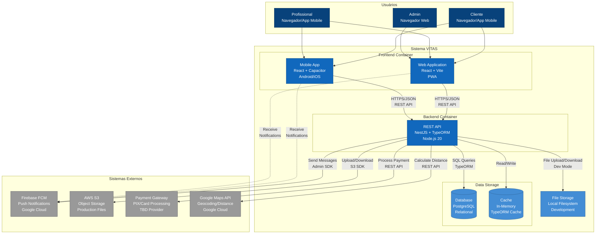

# C4 Model - Container Diagram

## Sistema VITAS - Containers

Este diagrama mostra os containers (aplicações e armazenamentos de dados) que compõem o sistema VITAS.



## Containers Detalhados

### 📱 Web Application (Frontend)
- **Tecnologia**: React 18 + Vite + TypeScript
- **Responsabilidades**:
  - UI/UX para todos os tipos de usuários
  - Progressive Web App (PWA) com service workers
  - Validações client-side
  - Cache offline (IndexedDB)
  - Integração com Capacitor para features nativas
- **Comunicação**:
  - Consome REST API via HTTPS
  - Recebe push notifications via Firebase
  - Armazena tokens JWT em localStorage
- **Deploy**: Netlify/Vercel (produção), localhost:5173 (dev)

### 📲 Mobile App (Frontend)
- **Tecnologia**: React 18 + Capacitor + Vite
- **Responsabilidades**:
  - Mesma codebase do Web App
  - Features nativas: câmera, GPS, push notifications
  - Offline-first com sincronização
  - APK/AAB para Android, IPA para iOS
- **Comunicação**:
  - REST API via HTTPS
  - Firebase FCM para notificações
  - Background sync quando online
- **Deploy**: Google Play Store, Apple App Store

### ⚙️ REST API (Backend)
- **Tecnologia**: NestJS 10 + TypeORM + Node.js 20
- **Responsabilidades**:
  - Autenticação/Autorização (JWT + bcrypt)
  - Lógica de negócio (triagem, agendamento, pagamento)
  - Validações server-side
  - Gerenciamento de arquivos (upload/download)
  - Integração com sistemas externos
  - WebSocket para real-time (futuro)
- **Endpoints principais**:
  - `/auth/*` - Login/registro
  - `/chamados/*` - CRUD de chamados
  - `/triagem/*` - Algoritmo de triagem
  - `/agendamentos/*` - Gestão de agenda
  - `/pagamentos/*` - Processamento
  - `/notifications/*` - Push notifications
  - `/storage/*` - Upload de arquivos
- **Deploy**: Railway/Render (produção), localhost:3000 (dev)

### 🗄️ PostgreSQL Database
- **Tecnologia**: PostgreSQL 15+
- **Responsabilidades**:
  - Armazenamento persistente de dados relacionais
  - Transações ACID
  - Constraints e validações
  - Índices para performance
- **Principais tabelas**:
  - `users` - Clientes, profissionais, admins
  - `chamados` - Chamados de manutenção
  - `orcamentos` - Orçamentos de profissionais
  - `agendamentos` - Agendas e reservas
  - `pagamentos` - Transações financeiras
  - `avaliacoes` - Feedbacks
  - `mensagens` - Chat entre cliente/profissional
- **Desenvolvimento**: SQLite (`./data/vitas.db`)
- **Produção**: PostgreSQL managed (Railway/Supabase)

### 💾 Cache (In-Memory)
- **Tecnologia**: TypeORM Query Cache
- **Responsabilidades**:
  - Cache de queries frequentes
  - Reduzir carga no database
  - TTL configurável
- **Uso**: Especialidades, configurações, listas de profissionais

### 📁 File Storage
- **Desenvolvimento**: Local Filesystem (`./uploads/`)
- **Produção**: AWS S3
- **Organização**:
  ```
  uploads/
    chamados/
      {chamadoId}/
        {uuid}.jpg
        {uuid}.mp4
    documentos/
      profissionais/
        {profissionalId}/
          {uuid}.pdf
  ```

## Protocolos e Formatos

### API REST
```typescript
// Request
POST /api/chamados
Authorization: Bearer {jwt_token}
Content-Type: application/json

{
  "descricao": "Vazamento no banheiro",
  "especialidade": "hidraulica",
  "fotos": ["base64..."]
}

// Response
{
  "id": "uuid",
  "status": "aguardando_triagem",
  "triagemScore": 85,
  "profissionaisSugeridos": [...]
}
```

### WebSocket (Futuro)
```typescript
// Cliente conecta
ws://api.vitas.com/ws?token={jwt}

// Server envia atualizações
{
  "event": "chamado.atualizado",
  "data": { "id": "...", "status": "em_andamento" }
}
```

### Push Notifications
```json
{
  "to": "fcm_token",
  "notification": {
    "title": "Novo orçamento recebido",
    "body": "R$ 150,00 - João Silva"
  },
  "data": {
    "chamadoId": "uuid",
    "action": "open_chamado"
  }
}
```

## Decisões de Arquitetura

### Por que NestJS?
- ✅ Estrutura modular e escalável
- ✅ TypeScript nativo
- ✅ Decorators facilitam validação e documentação
- ✅ Integração nativa com TypeORM
- ✅ Suporte a microservices (futuro)

### Por que TypeORM?
- ✅ Migrations automáticas
- ✅ Suporte SQLite (dev) + PostgreSQL (prod)
- ✅ Type-safety com TypeScript
- ✅ Query builder + Repository pattern

### Por que PostgreSQL?
- ✅ ACID compliance
- ✅ JSON fields para flexibilidade
- ✅ Full-text search nativo
- ✅ Escalabilidade horizontal (replicas)
- ✅ Managed services disponíveis (Railway, Supabase)

### Por que React + Capacitor?
- ✅ Code sharing entre web e mobile (90%+)
- ✅ Acesso a APIs nativas (câmera, GPS, notificações)
- ✅ PWA para web, APK/AAB para mobile
- ✅ Hot reload para desenvolvimento rápido
- ✅ Ecossistema maduro (plugins, libs)

## Escalabilidade

### Fase 1 (MVP - atual)
- Frontend: Netlify/Vercel (CDN global)
- Backend: Railway/Render (1 instância)
- Database: PostgreSQL managed (Railway)
- Files: Local filesystem (dev), S3 (prod)

### Fase 2 (Crescimento - 1000+ usuários)
- Backend: 2-3 instâncias + load balancer
- Database: Read replicas
- Cache: Redis separado
- CDN: CloudFront para S3

### Fase 3 (Escala - 10k+ usuários)
- Backend: Microservices (chamados, pagamentos, notificações)
- Database: Sharding por região
- Message Queue: RabbitMQ/SQS
- WebSocket: Servidor separado (Socket.io cluster)
