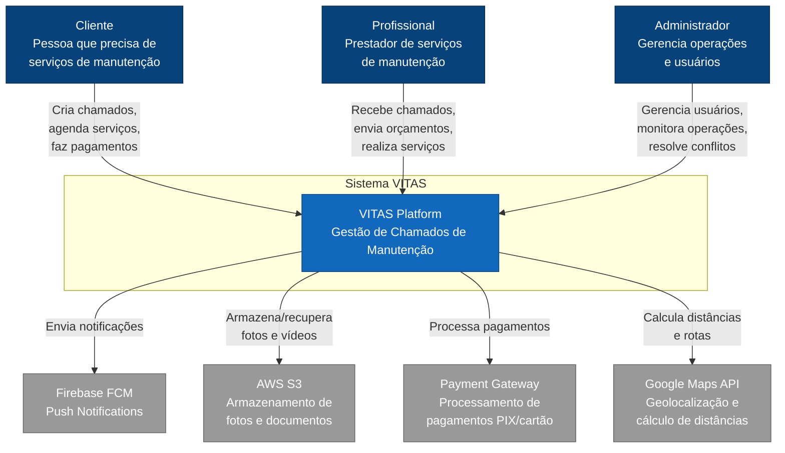

# C4 Model - Context Diagram

## Sistema VITAS - Contexto

Este diagrama mostra o sistema VITAS e seus usuários principais, bem como sistemas externos com os quais interage.



## Atores

### 👤 Cliente
- **Papel**: Usuário final que precisa de serviços de manutenção
- **Objetivos**:
  - Criar chamados de manutenção com fotos/vídeos
  - Receber triagem automática e sugestões de profissionais
  - Agendar serviços com profissionais disponíveis
  - Realizar pagamentos seguros
  - Avaliar serviços recebidos

### 👷 Profissional
- **Papel**: Prestador de serviços de manutenção
- **Objetivos**:
  - Visualizar chamados disponíveis próximos
  - Enviar orçamentos para clientes
  - Gerenciar agenda de atendimentos
  - Receber pagamentos
  - Construir reputação através de avaliações

### 👨‍💼 Administrador
- **Papel**: Gerente da plataforma
- **Objetivos**:
  - Gerenciar usuários (clientes e profissionais)
  - Monitorar operações e métricas
  - Resolver conflitos e disputas
  - Configurar sistema (especialidades, preços base, etc.)
  - Gerar relatórios de negócio

## Sistemas Externos

### 🔔 Firebase Cloud Messaging
- **Propósito**: Envio de push notifications
- **Uso**: Notificar sobre novos chamados, mensagens, pagamentos, avaliações

### 📦 AWS S3
- **Propósito**: Armazenamento de arquivos
- **Uso**: Fotos e vídeos de chamados, documentos de profissionais

### 💳 Payment Gateway
- **Propósito**: Processamento de pagamentos
- **Uso**: PIX, cartão de crédito/débito

### 🗺️ Google Maps API
- **Propósito**: Serviços de localização
- **Uso**: Calcular distância profissional-chamado, mostrar rotas

## Fluxos Principais

### 1. Criação de Chamado
```
Cliente → VITAS: Criar chamado com fotos
VITAS → AWS S3: Upload de mídia
VITAS → Cliente: Triagem automática + sugestões
VITAS → Firebase: Notificar profissionais próximos
```

### 2. Aceitação e Agendamento
```
Profissional → VITAS: Enviar orçamento
VITAS → Firebase: Notificar cliente
Cliente → VITAS: Aprovar orçamento + agendar
VITAS → Firebase: Confirmar para profissional
```

### 3. Pagamento
```
Cliente → VITAS: Confirmar pagamento
VITAS → Gateway: Processar transação
Gateway → VITAS: Confirmação
VITAS → Firebase: Notificar profissional
```

## Decisões de Arquitetura

### Por que Firebase FCM?
- ✅ Suporte nativo para Android/iOS/Web
- ✅ Confiável e escalável
- ✅ Gratuito até 10M mensagens/dia
- ✅ Integração simples com Capacitor

### Por que AWS S3?
- ✅ Armazenamento escalável e confiável
- ✅ CDN integrado (CloudFront)
- ✅ Signed URLs para segurança
- ✅ Fallback local para desenvolvimento

### Por que separar Backend/Frontend?
- ✅ Escalabilidade independente
- ✅ Deploy separado (mobile vs server)
- ✅ Tecnologias especializadas (React vs NestJS)
- ✅ Possibilidade de múltiplos frontends (web, mobile, admin)
